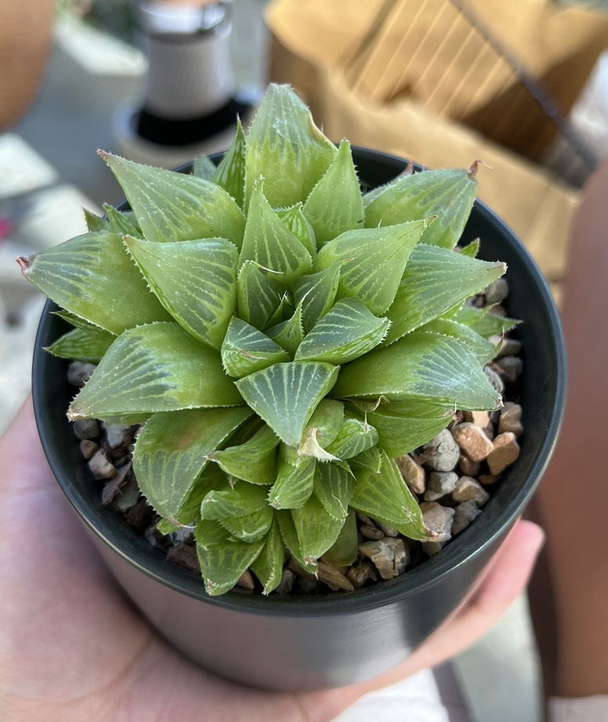

# Jeffrey Yang's User Page

### About Me

My name is **Jeffrey Yang**. I am a *fourth year* Cognitive Science major at <ins>UCSD</ins>.

> I am from Palo Alto, CA

Some of my `hobbies` include:
- Lifting
- MMA & Boxing
- Collecting succulents

 

My rankings of SD Cafes for studying:
1. Living Room La Jolla
2. Moniker Coffee Co.
3. The Forum
4. The Starbucks on Governor
5. Lestats (Hillcrest)

### Check out my succulent collection:

[Full Setup](imgs/PlantStand.png)

### Me as a Programmer

I'm interested in machine learning, specifically generative models and their applications for music.

This quarter, my goals are to:
- [ ] Get better with version control tools
- [ ] Familiarize myself more with frameworks commonly used in the industry
- [ ] Get better at programming in teams

 

My github can be accessed [here](https://github.com/jey013ucsd).

 

[Back to Top](#jeffrey-yangs-user-page)